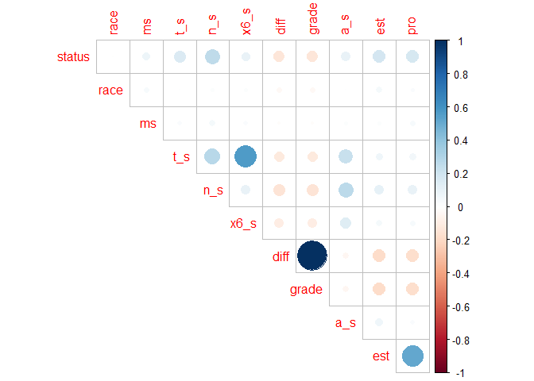

Logistic Regression
================
2023-12-06

# Clean the data

``` r
heart_df = 
  read_csv("./Project_2_data.csv") |> 
  janitor::clean_names() |> 
  relocate(survival_months, status) |> 
  mutate(
    race = as.numeric(factor(race, levels = c("White", "Black", "Other"))),
    marital_status = as.numeric(factor(marital_status, levels = c("Married", "Divorced", "Single", "Widowed", "Separated"))),
    t_stage = as.numeric(factor(t_stage, levels = c("T1", "T2", "T3", "T4"))),
    n_stage = as.numeric(factor(n_stage, levels = c("N1", "N2", "N3"))),
    x6th_stage = as.numeric(factor(x6th_stage, levels = c("IIA", "IIIA", "IIIC", "IIB", "IIIB"))),
    differentiate = as.numeric(factor(differentiate, levels = c("Poorly differentiated", "Moderately differentiated", "Well differentiated", "Undifferentiated"))),
    grade = as.numeric(factor(grade, levels = c("3", "2", "1", "anaplastic; Grade IV"))),
    a_stage = as.numeric(factor(a_stage, levels = c("Regional", "Distant"))),
    estrogen_status = as.numeric(factor(estrogen_status, levels = c("Positive", "Negative"))),
    progesterone_status = as.numeric(factor(progesterone_status, levels = c("Positive", "Negative"))),
    status = as.numeric(factor(status, levels = c("Alive", "Dead")))
  ) |> 
  rename(ms = "marital_status", 
         t_s = "t_stage",
         n_s = "n_stage",
         x6_s = "x6th_stage",
         a_s = "a_stage",
         diff = "differentiate",
         est = "estrogen_status",
         pro = "progesterone_status",
         rne = "regional_node_examined",
         rnp = "reginol_node_positive"
         )
```

    ## Rows: 4024 Columns: 16
    ## ── Column specification ────────────────────────────────────────────────────────
    ## Delimiter: ","
    ## chr (11): Race, Marital Status, T Stage, N Stage, 6th Stage, differentiate, ...
    ## dbl  (5): Age, Tumor Size, Regional Node Examined, Reginol Node Positive, Su...
    ## 
    ## ℹ Use `spec()` to retrieve the full column specification for this data.
    ## ℹ Specify the column types or set `show_col_types = FALSE` to quiet this message.

``` r
variablesummary = 
  lapply(heart_df[,3:16], table)
```

<font color = "blue">1. outcome: 1 continuous; 1 binary 2. predictors: 4
continuous; 10 categorical</font>

# Examine predictors

## For categorical variable

### Graphic plot

``` r
# Histograms for each categorical variables
par(mfrow=c(1,2))
hist(heart_df$status, main='status')
hist(heart_df$race, main='race')
```

<!-- -->

``` r
hist(heart_df$ms, main='ms')
hist(heart_df$t_s, main='t_s')
```

<!-- -->

``` r
hist(heart_df$n_s, main='n_s')
hist(heart_df$x6_s, main='x6_s')
```

<!-- -->

``` r
hist(heart_df$a_s, main='a_s')
hist(heart_df$diff, main='diff')
```

<!-- -->

``` r
hist(heart_df$grade, main='grade')
hist(heart_df$est, main='est')
```

<!-- -->

``` r
hist(heart_df$pro, main='pro')
```

<!-- -->

<font color = "blue">most categorical variables have a extremely skewed.
And I find that some variables like `grade` has a very small level. I
will focus on that in the following steps.</font>

### Char-squared test

``` r
heart_df_2 = 
  read_csv("./Project_2_data.csv") |> 
  janitor::clean_names() |> 
  relocate(survival_months, status) |> 
  dplyr::select("race", "marital_status", "t_stage", "n_stage", "x6th_stage", "differentiate", "grade", "a_stage", "estrogen_status", "progesterone_status") |> 
  mutate_all(as.factor)
```

    ## Rows: 4024 Columns: 16
    ## ── Column specification ────────────────────────────────────────────────────────
    ## Delimiter: ","
    ## chr (11): Race, Marital Status, T Stage, N Stage, 6th Stage, differentiate, ...
    ## dbl  (5): Age, Tumor Size, Regional Node Examined, Reginol Node Positive, Su...
    ## 
    ## ℹ Use `spec()` to retrieve the full column specification for this data.
    ## ℹ Specify the column types or set `show_col_types = FALSE` to quiet this message.

``` r
result_table = 
  data.frame(Variable1 = character(), 
             Variable2 = character(), 
             ChiSquare = numeric(), 
             PValue = numeric(), 
             stringsAsFactors = TRUE)


for (col1 in names(heart_df_2)[1:(ncol(heart_df_2) - 1)]) {
  for (col2 in names(heart_df_2)[(match(col1, names(heart_df_2)) + 1):ncol(heart_df_2)]) {
    
    contingency_table <- table(heart_df_2[[col1]], heart_df_2[[col2]])

    
    chi_sq_test_result <- chisq.test(contingency_table,
                                     correct = T)

    
    variable1 <- col1
    variable2 <- col2
    chi_square <- chi_sq_test_result$statistic
    p_value <- chi_sq_test_result$p.value

    
    result_table <- rbind(result_table, data.frame(variable1, variable2, chi_square, p_value))
  }
}

original_row_names = rownames(result_table)
new_row_names <- as.character(1:nrow(result_table))
rownames(result_table) <- new_row_names

result_table = 
  result_table |> 
  arrange(desc(p_value))

knitr::kable(result_table)
```

|     | variable1       | variable2           |   chi_square |   p_value |
|:----|:----------------|:--------------------|-------------:|----------:|
| 7   | race            | a_stage             | 3.069776e-01 | 0.8577104 |
| 4   | race            | x6th_stage          | 8.839562e+00 | 0.3560107 |
| 2   | race            | t_stage             | 8.462431e+00 | 0.2061430 |
| 3   | race            | n_stage             | 6.079684e+00 | 0.1932759 |
| 10  | marital_status  | t_stage             | 1.712041e+01 | 0.1451239 |
| 44  | a_stage         | progesterone_status | 2.382806e+00 | 0.1226770 |
| 15  | marital_status  | a_stage             | 7.658489e+00 | 0.1049203 |
| 16  | marital_status  | estrogen_status     | 7.690336e+00 | 0.1036033 |
| 13  | marital_status  | differentiate       | 1.915564e+01 | 0.0848409 |
| 14  | marital_status  | grade               | 1.915564e+01 | 0.0848409 |
| 9   | race            | progesterone_status | 5.043148e+00 | 0.0803331 |
| 12  | marital_status  | x6th_stage          | 2.810804e+01 | 0.0306927 |
| 17  | marital_status  | progesterone_status | 1.104690e+01 | 0.0260420 |
| 37  | differentiate   | a_stage             | 1.057708e+01 | 0.0142471 |
| 40  | grade           | a_stage             | 1.057708e+01 | 0.0142471 |
| 11  | marital_status  | n_stage             | 2.235252e+01 | 0.0043030 |
| 24  | t_stage         | progesterone_status | 1.380823e+01 | 0.0031781 |
| 8   | race            | estrogen_status     | 1.340900e+01 | 0.0012254 |
| 23  | t_stage         | estrogen_status     | 1.954986e+01 | 0.0002104 |
| 5   | race            | differentiate       | 2.790280e+01 | 0.0000980 |
| 6   | race            | grade               | 2.790280e+01 | 0.0000980 |
| 43  | a_stage         | estrogen_status     | 1.558922e+01 | 0.0000787 |
| 35  | x6th_stage      | progesterone_status | 4.248544e+01 | 0.0000000 |
| 30  | n_stage         | progesterone_status | 3.684600e+01 | 0.0000000 |
| 29  | n_stage         | estrogen_status     | 4.252308e+01 | 0.0000000 |
| 34  | x6th_stage      | estrogen_status     | 5.200461e+01 | 0.0000000 |
| 20  | t_stage         | differentiate       | 9.095689e+01 | 0.0000000 |
| 21  | t_stage         | grade               | 9.095689e+01 | 0.0000000 |
| 26  | n_stage         | differentiate       | 1.155011e+02 | 0.0000000 |
| 27  | n_stage         | grade               | 1.155011e+02 | 0.0000000 |
| 1   | race            | marital_status      | 1.379574e+02 | 0.0000000 |
| 31  | x6th_stage      | differentiate       | 1.580412e+02 | 0.0000000 |
| 32  | x6th_stage      | grade               | 1.580412e+02 | 0.0000000 |
| 39  | differentiate   | progesterone_status | 1.478031e+02 | 0.0000000 |
| 42  | grade           | progesterone_status | 1.478031e+02 | 0.0000000 |
| 38  | differentiate   | estrogen_status     | 2.174167e+02 | 0.0000000 |
| 41  | grade           | estrogen_status     | 2.174167e+02 | 0.0000000 |
| 18  | t_stage         | n_stage             | 3.234137e+02 | 0.0000000 |
| 28  | n_stage         | a_stage             | 3.555764e+02 | 0.0000000 |
| 22  | t_stage         | a_stage             | 5.832589e+02 | 0.0000000 |
| 33  | x6th_stage      | a_stage             | 7.291926e+02 | 0.0000000 |
| 45  | estrogen_status | progesterone_status | 1.054843e+03 | 0.0000000 |
| 19  | t_stage         | x6th_stage          | 6.784079e+03 | 0.0000000 |
| 25  | n_stage         | x6th_stage          | 6.686834e+03 | 0.0000000 |
| 36  | differentiate   | grade               | 1.207200e+04 | 0.0000000 |

<font color = "blue">There’re many categorical variables correlate with
others. Particularly, difference and grade should preserve one. I delete
`differentiate`. What’s more, delete `x6th_stage`, `est` on account of
their extremely small p-values.</font>

### Correlation for categorical variables

``` r
par(mfrow = c(1, 1), mar = c(5, 4, 4, 2) + 0.1)
cor_cate = cor(heart_df[,c(2, 4:11, 13:14)])

corrplot(cor_cate, type = "upper", diag = FALSE, mar = c(0, 0, 0, 0))
```

<!-- -->

<font color = "blue"> There is apparent linear correlation among
variables between diff and grade; t_s and x6_s; est and pro. with the
outcome we get from chi-squared test, I delete `x6th_stage`, `est` and
`diff` variable for the further study.</font>

## For continuous variable

### Graphic plot

``` r
# Boxplots for each continuous variable
par(mfrow=c(2,3))
boxplot(heart_df$survival_months, main='survival_months')
boxplot(heart_df$age, main='age')
boxplot(heart_df$tumor_size, main='tumor_size')
boxplot(heart_df$rne, main='rne')
boxplot(heart_df$rnp, main='rnp')
```

<!-- -->

``` r
p1 =ggplot(heart_df, aes(x = survival_months)) + geom_density()
p2 = ggplot(heart_df, aes(x = age)) + geom_density()
p3 = ggplot(heart_df, aes(x = tumor_size)) + geom_density()
p4 = ggplot(heart_df, aes(x = rne)) + geom_density()
p5 = ggplot(heart_df, aes(x = rnp)) + geom_density()

combined_plot = plot_grid(p1, p2, p3, p4, p5, 
                           ncol = 3,
                           nrow = 2)
combined_plot
```

<!-- -->

<font color = "blue">Among all the 5 continuous variables, we can find
that `age` is the only predictor which is normally distributed. The
other three variables are not normally distributed. Because the logistic
regression doesn’t need the predictors to be normally distributed, I
didn’t transform these predictors.</font>

### Rank-sum test and t-test

``` r
result1 = t.test(age ~ status, data = heart_df)
result2 = wilcox.test(tumor_size ~ status, data = heart_df)
result3 = wilcox.test(rne ~ status, data = heart_df)
result4 = wilcox.test(rnp ~ status, data = heart_df)

broom::tidy(result1)
```

    ## # A tibble: 1 × 10
    ##   estimate estimate1 estimate2 statistic  p.value parameter conf.low conf.high
    ##      <dbl>     <dbl>     <dbl>     <dbl>    <dbl>     <dbl>    <dbl>     <dbl>
    ## 1    -1.39      53.8      55.2     -3.32 0.000931      809.    -2.21    -0.570
    ## # ℹ 2 more variables: method <chr>, alternative <chr>

``` r
broom::tidy(result2)
```

    ## # A tibble: 1 × 4
    ##   statistic  p.value method                                          alternative
    ##       <dbl>    <dbl> <chr>                                           <chr>      
    ## 1    813236 4.85e-19 Wilcoxon rank sum test with continuity correct… two.sided

``` r
broom::tidy(result3)
```

    ## # A tibble: 1 × 4
    ##   statistic p.value method                                           alternative
    ##       <dbl>   <dbl> <chr>                                            <chr>      
    ## 1   1001152  0.0673 Wilcoxon rank sum test with continuity correcti… two.sided

``` r
broom::tidy(result4)
```

    ## # A tibble: 1 × 4
    ##   statistic  p.value method                                          alternative
    ##       <dbl>    <dbl> <chr>                                           <chr>      
    ## 1   692562. 6.82e-44 Wilcoxon rank sum test with continuity correct… two.sided

<font color = "blue"> I use two-sample t test to check age and rank-sum
test check other three variables. `rne` has a different median compared
between two groups stratified by `status`. But, we can’t delete this
variable just on account of its rank-sum test outcome, I will focus on
this variable in the further study. </font>

## Check the dataset again

``` r
heart_df_log = 
  read_csv("./Project_2_data.csv") |> 
  janitor::clean_names() |> 
  relocate(survival_months, status) |> 
  filter(!grade %in% c("anaplastic; Grade IV")) |> 
  mutate(
    race = factor(race, levels = c("White", "Black", "Other")),
    marital_status = factor(marital_status, levels = c("Married", "Divorced", "Single", "Widowed", "Separated")),
    t_stage = factor(t_stage, levels = c("T1", "T2", "T3", "T4")),
    n_stage = factor(n_stage, levels = c("N1", "N2", "N3")),
    grade = factor(grade, levels = c("3", "2", "1")),
    a_stage = factor(a_stage, levels = c("Regional", "Distant")),
    progesterone_status = factor(progesterone_status, levels = c("Positive", "Negative")),
    status = factor(status, levels = c("Alive", "Dead"))) |> 
  dplyr::select(-survival_months, -differentiate, -x6th_stage, -estrogen_status) 
```

    ## Rows: 4024 Columns: 16
    ## ── Column specification ────────────────────────────────────────────────────────
    ## Delimiter: ","
    ## chr (11): Race, Marital Status, T Stage, N Stage, 6th Stage, differentiate, ...
    ## dbl  (5): Age, Tumor Size, Regional Node Examined, Reginol Node Positive, Su...
    ## 
    ## ℹ Use `spec()` to retrieve the full column specification for this data.
    ## ℹ Specify the column types or set `show_col_types = FALSE` to quiet this message.

``` r
summary(heart_df_log)
```

    ##    status          age           race        marital_status t_stage   n_stage  
    ##  Alive:3398   Min.   :30.00   White:3397   Married  :2632   T1:1598   N1:2722  
    ##  Dead : 607   1st Qu.:47.00   Black: 288   Divorced : 485   T2:1781   N2: 816  
    ##               Median :54.00   Other: 320   Single   : 610   T3: 526   N3: 467  
    ##               Mean   :53.98                Widowed  : 234   T4: 100            
    ##               3rd Qu.:61.00                Separated:  44                      
    ##               Max.   :69.00                                                    
    ##  grade        a_stage       tumor_size     progesterone_status
    ##  3:1111   Regional:3913   Min.   :  1.00   Positive:3311      
    ##  2:2351   Distant :  92   1st Qu.: 16.00   Negative: 694      
    ##  1: 543                   Median : 25.00                      
    ##                           Mean   : 30.41                      
    ##                           3rd Qu.: 38.00                      
    ##                           Max.   :140.00                      
    ##  regional_node_examined reginol_node_positive
    ##  Min.   : 1.00          Min.   : 1.000       
    ##  1st Qu.: 9.00          1st Qu.: 1.000       
    ##  Median :14.00          Median : 2.000       
    ##  Mean   :14.36          Mean   : 4.149       
    ##  3rd Qu.:19.00          3rd Qu.: 5.000       
    ##  Max.   :61.00          Max.   :46.000

``` r
str(heart_df_log)
```

    ## tibble [4,005 × 12] (S3: tbl_df/tbl/data.frame)
    ##  $ status                : Factor w/ 2 levels "Alive","Dead": 1 1 1 1 1 1 1 2 1 1 ...
    ##  $ age                   : num [1:4005] 68 50 58 58 47 51 51 40 40 69 ...
    ##  $ race                  : Factor w/ 3 levels "White","Black",..: 1 1 1 1 1 1 1 1 1 1 ...
    ##  $ marital_status        : Factor w/ 5 levels "Married","Divorced",..: 1 1 2 1 1 3 1 1 2 1 ...
    ##  $ t_stage               : Factor w/ 4 levels "T1","T2","T3",..: 1 2 3 1 2 1 1 2 4 4 ...
    ##  $ n_stage               : Factor w/ 3 levels "N1","N2","N3": 1 2 3 1 1 1 1 1 3 3 ...
    ##  $ grade                 : Factor w/ 3 levels "3","2","1": 1 2 2 1 1 2 3 2 1 3 ...
    ##  $ a_stage               : Factor w/ 2 levels "Regional","Distant": 1 1 1 1 1 1 1 1 1 2 ...
    ##  $ tumor_size            : num [1:4005] 4 35 63 18 41 20 8 30 103 32 ...
    ##  $ progesterone_status   : Factor w/ 2 levels "Positive","Negative": 1 1 1 1 1 1 1 1 1 1 ...
    ##  $ regional_node_examined: num [1:4005] 24 14 14 2 3 18 11 9 20 21 ...
    ##  $ reginol_node_positive : num [1:4005] 1 5 7 1 1 2 1 1 18 12 ...

<font color = "blue">according to the procedure, I get the final dataset
to make a logistic regression. 1,delete 4 level grade data for its
anaplastic mode. 2, delete three categorical variables,
namely`differentiate`, `x6th_stage`,`estrogen_status`. 3, delete the
`survival_months` cause it’s not the variable of our interest. 4, I’ll
attach more importance on the variable `regional_node_examined`, so it
will be tested by Wald test to check whether it should be deleted.
</font>

### Examine interaction

``` r
glm_result_1 = glm(data = heart_df_log,
                 status ~ a_stage * reginol_node_positive,
                 binomial(link = 'logit'))
broom::tidy(glm_result_1)
```

    ## # A tibble: 4 × 5
    ##   term                                 estimate std.error statistic   p.value
    ##   <chr>                                   <dbl>     <dbl>     <dbl>     <dbl>
    ## 1 (Intercept)                            -2.28    0.0629     -36.3  6.51e-288
    ## 2 a_stageDistant                          1.81    0.397        4.55 5.25e-  6
    ## 3 reginol_node_positive                   0.107   0.00774     13.8  1.48e- 43
    ## 4 a_stageDistant:reginol_node_positive   -0.108   0.0286      -3.79 1.50e-  4

``` r
glm_result_2 = glm(data = heart_df_log,
                 status ~ regional_node_examined * reginol_node_positive,
                 binomial(link = 'logit'))
broom::tidy(glm_result_2)
```

    ## # A tibble: 4 × 5
    ##   term                                     estimate std.error statistic  p.value
    ##   <chr>                                       <dbl>     <dbl>     <dbl>    <dbl>
    ## 1 (Intercept)                              -2.13     0.120       -17.8  1.52e-70
    ## 2 regional_node_examined                   -0.0218   0.00790      -2.76 5.74e- 3
    ## 3 reginol_node_positive                     0.199    0.0196       10.2  3.03e-24
    ## 4 regional_node_examined:reginol_node_pos… -0.00300  0.000744     -4.02 5.71e- 5

<font color = "blue">I check all the 2 variable group to find whether
there exists a correlation effect, and find `a_stage` and
`reginol_node_positive`’s interaction p-value is 1.50e-4.
`regional_node_examined` and `reginol_node_positive`’s interaction
p-value is 5.71e-5. Their interaction events play vital roles in our
model. Therefore, I will put these two interaction event in my following
models.</font>

# Model variable select

## 1. Stepwise

### build model

``` r
model = 
  glm(status ~ . + a_stage * reginol_node_positive + regional_node_examined * reginol_node_positive, 
      data = heart_df_log, 
      family = binomial(link = 'logit'))

summary(model)
```

    ## 
    ## Call:
    ## glm(formula = status ~ . + a_stage * reginol_node_positive + 
    ##     regional_node_examined * reginol_node_positive, family = binomial(link = "logit"), 
    ##     data = heart_df_log)
    ## 
    ## Coefficients:
    ##                                                Estimate Std. Error z value
    ## (Intercept)                                  -3.3157333  0.3565548  -9.299
    ## age                                           0.0214016  0.0055957   3.825
    ## raceBlack                                     0.5285528  0.1617692   3.267
    ## raceOther                                    -0.4105070  0.2015324  -2.037
    ## marital_statusDivorced                        0.1979062  0.1413430   1.400
    ## marital_statusSingle                          0.1233095  0.1354483   0.910
    ## marital_statusWidowed                         0.2141907  0.1925412   1.112
    ## marital_statusSeparated                       0.8660280  0.3712285   2.333
    ## t_stageT2                                     0.3805790  0.1313527   2.897
    ## t_stageT3                                     0.5016913  0.2663068   1.884
    ## t_stageT4                                     0.9958936  0.3197436   3.115
    ## n_stageN2                                     0.3312383  0.1474584   2.246
    ## n_stageN3                                     0.3904381  0.2757280   1.416
    ## grade2                                       -0.4487602  0.1030829  -4.353
    ## grade1                                       -0.9931654  0.1916765  -5.181
    ## a_stageDistant                                0.7656274  0.4833319   1.584
    ## tumor_size                                    0.0003454  0.0039406   0.088
    ## progesterone_statusNegative                   0.8338434  0.1082163   7.705
    ## regional_node_examined                       -0.0316316  0.0084370  -3.749
    ## reginol_node_positive                         0.1125016  0.0324023   3.472
    ## a_stageDistant:reginol_node_positive         -0.0542828  0.0319926  -1.697
    ## regional_node_examined:reginol_node_positive -0.0007918  0.0008745  -0.905
    ##                                              Pr(>|z|)    
    ## (Intercept)                                   < 2e-16 ***
    ## age                                          0.000131 ***
    ## raceBlack                                    0.001086 ** 
    ## raceOther                                    0.041657 *  
    ## marital_statusDivorced                       0.161458    
    ## marital_statusSingle                         0.362622    
    ## marital_statusWidowed                        0.265949    
    ## marital_statusSeparated                      0.019655 *  
    ## t_stageT2                                    0.003763 ** 
    ## t_stageT3                                    0.059581 .  
    ## t_stageT4                                    0.001842 ** 
    ## n_stageN2                                    0.024684 *  
    ## n_stageN3                                    0.156768    
    ## grade2                                       1.34e-05 ***
    ## grade1                                       2.20e-07 ***
    ## a_stageDistant                               0.113180    
    ## tumor_size                                   0.930156    
    ## progesterone_statusNegative                  1.30e-14 ***
    ## regional_node_examined                       0.000177 ***
    ## reginol_node_positive                        0.000517 ***
    ## a_stageDistant:reginol_node_positive         0.089748 .  
    ## regional_node_examined:reginol_node_positive 0.365255    
    ## ---
    ## Signif. codes:  0 '***' 0.001 '**' 0.01 '*' 0.05 '.' 0.1 ' ' 1
    ## 
    ## (Dispersion parameter for binomial family taken to be 1)
    ## 
    ##     Null deviance: 3407.5  on 4004  degrees of freedom
    ## Residual deviance: 2946.1  on 3983  degrees of freedom
    ## AIC: 2990.1
    ## 
    ## Number of Fisher Scoring iterations: 5

``` r
model_step = step(model, direction = "both")
```

    ## Start:  AIC=2990.1
    ## status ~ age + race + marital_status + t_stage + n_stage + grade + 
    ##     a_stage + tumor_size + progesterone_status + regional_node_examined + 
    ##     reginol_node_positive + a_stage * reginol_node_positive + 
    ##     regional_node_examined * reginol_node_positive
    ## 
    ##                                                Df Deviance    AIC
    ## - tumor_size                                    1   2946.1 2988.1
    ## - regional_node_examined:reginol_node_positive  1   2946.9 2988.9
    ## - marital_status                                4   2953.5 2989.5
    ## <none>                                              2946.1 2990.1
    ## - a_stage:reginol_node_positive                 1   2949.0 2991.0
    ## - n_stage                                       2   2951.1 2991.1
    ## - t_stage                                       3   2958.9 2996.9
    ## - race                                          2   2961.9 3001.9
    ## - age                                           1   2960.9 3002.9
    ## - grade                                         2   2981.9 3021.9
    ## - progesterone_status                           1   3002.6 3044.6
    ## 
    ## Step:  AIC=2988.11
    ## status ~ age + race + marital_status + t_stage + n_stage + grade + 
    ##     a_stage + progesterone_status + regional_node_examined + 
    ##     reginol_node_positive + a_stage:reginol_node_positive + regional_node_examined:reginol_node_positive
    ## 
    ##                                                Df Deviance    AIC
    ## - regional_node_examined:reginol_node_positive  1   2946.9 2986.9
    ## - marital_status                                4   2953.5 2987.5
    ## <none>                                              2946.1 2988.1
    ## - a_stage:reginol_node_positive                 1   2949.0 2989.0
    ## - n_stage                                       2   2951.2 2989.2
    ## + tumor_size                                    1   2946.1 2990.1
    ## - race                                          2   2962.0 3000.0
    ## - age                                           1   2960.9 3000.9
    ## - t_stage                                       3   2969.1 3005.1
    ## - grade                                         2   2982.0 3020.0
    ## - progesterone_status                           1   3002.7 3042.7
    ## 
    ## Step:  AIC=2986.93
    ## status ~ age + race + marital_status + t_stage + n_stage + grade + 
    ##     a_stage + progesterone_status + regional_node_examined + 
    ##     reginol_node_positive + a_stage:reginol_node_positive
    ## 
    ##                                                Df Deviance    AIC
    ## - marital_status                                4   2954.4 2986.4
    ## <none>                                              2946.9 2986.9
    ## - a_stage:reginol_node_positive                 1   2949.6 2987.6
    ## + regional_node_examined:reginol_node_positive  1   2946.1 2988.1
    ## + tumor_size                                    1   2946.9 2988.9
    ## - n_stage                                       2   2956.3 2992.3
    ## - race                                          2   2962.8 2998.8
    ## - age                                           1   2961.7 2999.7
    ## - t_stage                                       3   2971.3 3005.3
    ## - regional_node_examined                        1   2973.0 3011.0
    ## - grade                                         2   2982.9 3018.9
    ## - progesterone_status                           1   3003.4 3041.4
    ## 
    ## Step:  AIC=2986.4
    ## status ~ age + race + t_stage + n_stage + grade + a_stage + progesterone_status + 
    ##     regional_node_examined + reginol_node_positive + a_stage:reginol_node_positive
    ## 
    ##                                                Df Deviance    AIC
    ## <none>                                              2954.4 2986.4
    ## + marital_status                                4   2946.9 2986.9
    ## - a_stage:reginol_node_positive                 1   2956.9 2986.9
    ## + regional_node_examined:reginol_node_positive  1   2953.5 2987.5
    ## + tumor_size                                    1   2954.4 2988.4
    ## - n_stage                                       2   2963.6 2991.6
    ## - age                                           1   2970.9 3000.9
    ## - race                                          2   2973.2 3001.2
    ## - t_stage                                       3   2979.5 3005.5
    ## - regional_node_examined                        1   2981.0 3011.0
    ## - grade                                         2   2989.9 3017.9
    ## - progesterone_status                           1   3012.5 3042.5

``` r
summary(model_step)
```

    ## 
    ## Call:
    ## glm(formula = status ~ age + race + t_stage + n_stage + grade + 
    ##     a_stage + progesterone_status + regional_node_examined + 
    ##     reginol_node_positive + a_stage:reginol_node_positive, family = binomial(link = "logit"), 
    ##     data = heart_df_log)
    ## 
    ## Coefficients:
    ##                                       Estimate Std. Error z value Pr(>|z|)    
    ## (Intercept)                          -3.207333   0.332597  -9.643  < 2e-16 ***
    ## age                                   0.021862   0.005419   4.034 5.48e-05 ***
    ## raceBlack                             0.580034   0.158385   3.662 0.000250 ***
    ## raceOther                            -0.418754   0.201019  -2.083 0.037237 *  
    ## t_stageT2                             0.406565   0.112837   3.603 0.000314 ***
    ## t_stageT3                             0.532044   0.148621   3.580 0.000344 ***
    ## t_stageT4                             1.042480   0.268893   3.877 0.000106 ***
    ## n_stageN2                             0.389858   0.129955   3.000 0.002700 ** 
    ## n_stageN3                             0.505349   0.241470   2.093 0.036367 *  
    ## grade2                               -0.449129   0.102872  -4.366 1.27e-05 ***
    ## grade1                               -0.980279   0.190720  -5.140 2.75e-07 ***
    ## a_stageDistant                        0.726733   0.479490   1.516 0.129611    
    ## progesterone_statusNegative           0.844014   0.107933   7.820 5.29e-15 ***
    ## regional_node_examined               -0.036050   0.007232  -4.985 6.20e-07 ***
    ## reginol_node_positive                 0.088394   0.015965   5.537 3.08e-08 ***
    ## a_stageDistant:reginol_node_positive -0.050505   0.031625  -1.597 0.110274    
    ## ---
    ## Signif. codes:  0 '***' 0.001 '**' 0.01 '*' 0.05 '.' 0.1 ' ' 1
    ## 
    ## (Dispersion parameter for binomial family taken to be 1)
    ## 
    ##     Null deviance: 3407.5  on 4004  degrees of freedom
    ## Residual deviance: 2954.4  on 3989  degrees of freedom
    ## AIC: 2986.4
    ## 
    ## Number of Fisher Scoring iterations: 5

``` r
waldtest(model_step, "regional_node_examined")
```

    ## Wald test
    ## 
    ## Model 1: status ~ age + race + t_stage + n_stage + grade + a_stage + progesterone_status + 
    ##     regional_node_examined + reginol_node_positive + a_stage:reginol_node_positive
    ## Model 2: status ~ age + race + t_stage + n_stage + grade + a_stage + progesterone_status + 
    ##     reginol_node_positive + a_stage:reginol_node_positive
    ##   Res.Df Df      F    Pr(>F)    
    ## 1   3989                        
    ## 2   3990 -1 24.848 6.467e-07 ***
    ## ---
    ## Signif. codes:  0 '***' 0.001 '**' 0.01 '*' 0.05 '.' 0.1 ' ' 1

<font color = "blue"> 1.stepwise: delete the variable `tumor_size`,
`regional_node_examined:reginol_node_positive`, `marital_status`2. Wald
test shows a p-value 6.467e-07, which demonstrates that we should
preserve the variable `regional_node_examined` though it has a different
median between two groups stratified by status.</font>

<font color = "red"> Attention here please! In this process, the
stepwise help me delete the interaction event
`regional_node_examined:reginol_node_positive` but preserve the
interaction `a_stage:reginol_node_positive` which means the latter one
has a larger influence upon the whole model.</font>

### the model

``` r
formula1 = 
  as.formula(
  status ~ age + race + t_stage + n_stage + grade + a_stage + progesterone_status + regional_node_examined + reginol_node_positive + a_stage:reginol_node_positive)

model = glm(formula1, 
            data = heart_df_log, 
            family = binomial(link = 'logit'))

summary(model)
```

    ## 
    ## Call:
    ## glm(formula = formula1, family = binomial(link = "logit"), data = heart_df_log)
    ## 
    ## Coefficients:
    ##                                       Estimate Std. Error z value Pr(>|z|)    
    ## (Intercept)                          -3.207333   0.332597  -9.643  < 2e-16 ***
    ## age                                   0.021862   0.005419   4.034 5.48e-05 ***
    ## raceBlack                             0.580034   0.158385   3.662 0.000250 ***
    ## raceOther                            -0.418754   0.201019  -2.083 0.037237 *  
    ## t_stageT2                             0.406565   0.112837   3.603 0.000314 ***
    ## t_stageT3                             0.532044   0.148621   3.580 0.000344 ***
    ## t_stageT4                             1.042480   0.268893   3.877 0.000106 ***
    ## n_stageN2                             0.389858   0.129955   3.000 0.002700 ** 
    ## n_stageN3                             0.505349   0.241470   2.093 0.036367 *  
    ## grade2                               -0.449129   0.102872  -4.366 1.27e-05 ***
    ## grade1                               -0.980279   0.190720  -5.140 2.75e-07 ***
    ## a_stageDistant                        0.726733   0.479490   1.516 0.129611    
    ## progesterone_statusNegative           0.844014   0.107933   7.820 5.29e-15 ***
    ## regional_node_examined               -0.036050   0.007232  -4.985 6.20e-07 ***
    ## reginol_node_positive                 0.088394   0.015965   5.537 3.08e-08 ***
    ## a_stageDistant:reginol_node_positive -0.050505   0.031625  -1.597 0.110274    
    ## ---
    ## Signif. codes:  0 '***' 0.001 '**' 0.01 '*' 0.05 '.' 0.1 ' ' 1
    ## 
    ## (Dispersion parameter for binomial family taken to be 1)
    ## 
    ##     Null deviance: 3407.5  on 4004  degrees of freedom
    ## Residual deviance: 2954.4  on 3989  degrees of freedom
    ## AIC: 2986.4
    ## 
    ## Number of Fisher Scoring iterations: 5

``` r
check_collinearity(model)
```

    ## # Check for Multicollinearity
    ## 
    ## Low Correlation
    ## 
    ##                           Term  VIF   VIF 95% CI Increased SE Tolerance
    ##                            age 1.03 [1.01, 1.09]         1.01      0.97
    ##                           race 1.02 [1.00, 1.10]         1.01      0.98
    ##                        t_stage 1.36 [1.31, 1.41]         1.16      0.74
    ##                        n_stage 4.10 [3.88, 4.33]         2.02      0.24
    ##                          grade 1.08 [1.05, 1.12]         1.04      0.93
    ##                        a_stage 4.27 [4.04, 4.51]         2.07      0.23
    ##            progesterone_status 1.04 [1.02, 1.09]         1.02      0.96
    ##         regional_node_examined 1.48 [1.43, 1.55]         1.22      0.67
    ##          reginol_node_positive 4.68 [4.43, 4.94]         2.16      0.21
    ##  a_stage:reginol_node_positive 3.90 [3.70, 4.12]         1.98      0.26
    ##  Tolerance 95% CI
    ##      [0.92, 0.99]
    ##      [0.91, 1.00]
    ##      [0.71, 0.76]
    ##      [0.23, 0.26]
    ##      [0.89, 0.95]
    ##      [0.22, 0.25]
    ##      [0.92, 0.98]
    ##      [0.65, 0.70]
    ##      [0.20, 0.23]
    ##      [0.24, 0.27]

<font color = "blue"> We find our first model and check its
collinearity, the model’s performance is good.</font>

## 2. Random forest

### build model

``` r
set.seed(123)
model = 
  randomForest(status ~ . + a_stage * reginol_node_positive + regional_node_examined * reginol_node_positive,
               data = heart_df_log)

summary(model)
```

    ##                 Length Class  Mode     
    ## call               3   -none- call     
    ## type               1   -none- character
    ## predicted       4005   factor numeric  
    ## err.rate        1500   -none- numeric  
    ## confusion          6   -none- numeric  
    ## votes           8010   matrix numeric  
    ## oob.times       4005   -none- numeric  
    ## classes            2   -none- character
    ## importance        11   -none- numeric  
    ## importanceSD       0   -none- NULL     
    ## localImportance    0   -none- NULL     
    ## proximity          0   -none- NULL     
    ## ntree              1   -none- numeric  
    ## mtry               1   -none- numeric  
    ## forest            14   -none- list     
    ## y               4005   factor numeric  
    ## test               0   -none- NULL     
    ## inbag              0   -none- NULL     
    ## terms              3   terms  call

``` r
plot(model)
```

<!-- -->

``` r
forest_min = which.min(model$err.rate[,1])
```

<font color = "blue"> the forest_min which is the best parameter in the
regression is 320</font>

``` r
model_forest = 
  randomForest(status ~ . + a_stage * reginol_node_positive + regional_node_examined * reginol_node_positive, 
               data = heart_df_log, 
               ntree = forest_min, 
               mtry = 4)

knitr::kable(model_forest$confusion)
```

|       | Alive | Dead | class.error |
|:------|------:|-----:|------------:|
| Alive |  3303 |   95 |   0.0279576 |
| Dead  |   531 |   76 |   0.8747941 |

<font color = "blue"> in the simulation process, we get a outcome: the
model prediction ability towards alive is good ,but when it comes to the
dead, the class.error reaches nearly 0.87 which is a large
number.</font>

``` r
importance(model_forest)
```

    ##                        MeanDecreaseGini
    ## age                           190.67222
    ## race                           35.25882
    ## marital_status                 71.36831
    ## t_stage                        40.70758
    ## n_stage                        45.74057
    ## grade                          43.35355
    ## a_stage                         8.17414
    ## tumor_size                    186.30685
    ## progesterone_status            33.25173
    ## regional_node_examined        189.38867
    ## reginol_node_positive         131.57251

``` r
par(mfrow = c(1, 1), mar = c(4, 4, 2, 1), oma = c(0, 0, 2, 0))
varImpPlot(model_forest)
```

<!-- -->

``` r
par(mfrow = c(1, 1), mar = c(5, 4, 4, 2) + 0.1, oma = c(0, 0, 0, 0))
```

<font color = "blue"> according to the picture, I find the first 5 most
important variables have a mean decrease gini over 50, which is
significantly larger than other variables, so I use these variables to
build my final model.</font>

### the model

``` r
formula2 = 
  as.formula(
  status ~ age + regional_node_examined + tumor_size + reginol_node_positive + marital_status)

model = glm(formula2, 
            data = heart_df_log, 
            family = binomial(link = 'logit'))

summary(model)
```

    ## 
    ## Call:
    ## glm(formula = formula2, family = binomial(link = "logit"), data = heart_df_log)
    ## 
    ## Coefficients:
    ##                          Estimate Std. Error z value Pr(>|z|)    
    ## (Intercept)             -3.248738   0.325798  -9.972  < 2e-16 ***
    ## age                      0.018089   0.005398   3.351 0.000805 ***
    ## regional_node_examined  -0.034997   0.006990  -5.007 5.52e-07 ***
    ## tumor_size               0.010230   0.001977   5.175 2.28e-07 ***
    ## reginol_node_positive    0.117507   0.008906  13.194  < 2e-16 ***
    ## marital_statusDivorced   0.275010   0.136973   2.008 0.044668 *  
    ## marital_statusSingle     0.258083   0.129079   1.999 0.045563 *  
    ## marital_statusWidowed    0.318806   0.184381   1.729 0.083799 .  
    ## marital_statusSeparated  0.971231   0.353981   2.744 0.006074 ** 
    ## ---
    ## Signif. codes:  0 '***' 0.001 '**' 0.01 '*' 0.05 '.' 0.1 ' ' 1
    ## 
    ## (Dispersion parameter for binomial family taken to be 1)
    ## 
    ##     Null deviance: 3407.5  on 4004  degrees of freedom
    ## Residual deviance: 3124.2  on 3996  degrees of freedom
    ## AIC: 3142.2
    ## 
    ## Number of Fisher Scoring iterations: 5

``` r
check_collinearity(model)
```

    ## # Check for Multicollinearity
    ## 
    ## Low Correlation
    ## 
    ##                    Term  VIF   VIF 95% CI Increased SE Tolerance
    ##                     age 1.08 [1.05, 1.12]         1.04      0.93
    ##  regional_node_examined 1.47 [1.41, 1.53]         1.21      0.68
    ##              tumor_size 1.05 [1.03, 1.10]         1.03      0.95
    ##   reginol_node_positive 1.51 [1.45, 1.57]         1.23      0.66
    ##          marital_status 1.07 [1.04, 1.12]         1.03      0.94
    ##  Tolerance 95% CI
    ##      [0.89, 0.95]
    ##      [0.65, 0.71]
    ##      [0.91, 0.97]
    ##      [0.64, 0.69]
    ##      [0.90, 0.96]

<font color = "blue"> We find our second model and check its
collinearity, the model’s performance is good.</font>

## 3. LASSO

### build model

``` r
x = as.matrix(heart_df_log[,2:12])
y = as.matrix(heart_df_log[,1])

model_lasso =
  glmnet(x, y, alpha = 1, family = "binomial")

model_lasso
```

    ## 
    ## Call:  glmnet(x = x, y = y, family = "binomial", alpha = 1) 
    ## 
    ##    Df %Dev   Lambda
    ## 1   0 0.00 0.091580
    ## 2   1 1.23 0.083440
    ## 3   1 2.16 0.076030
    ## 4   1 2.88 0.069270
    ## 5   1 3.45 0.063120
    ## 6   1 3.91 0.057510
    ## 7   1 4.27 0.052400
    ## 8   2 4.72 0.047750
    ## 9   2 5.26 0.043510
    ## 10  2 5.70 0.039640
    ## 11  2 6.07 0.036120
    ## 12  3 6.40 0.032910
    ## 13  3 6.75 0.029990
    ## 14  3 7.04 0.027320
    ## 15  3 7.28 0.024900
    ## 16  3 7.48 0.022680
    ## 17  4 7.71 0.020670
    ## 18  4 7.94 0.018830
    ## 19  5 8.24 0.017160
    ## 20  5 8.52 0.015640
    ## 21  5 8.75 0.014250
    ## 22  5 8.95 0.012980
    ## 23  5 9.11 0.011830
    ## 24  5 9.25 0.010780
    ## 25  5 9.36 0.009819
    ## 26  5 9.46 0.008947
    ## 27  5 9.54 0.008152
    ## 28  5 9.61 0.007428
    ## 29  5 9.67 0.006768
    ## 30  5 9.71 0.006167
    ## 31  5 9.75 0.005619
    ## 32  5 9.79 0.005120
    ## 33  5 9.81 0.004665
    ## 34  5 9.84 0.004251
    ## 35  5 9.86 0.003873
    ## 36  5 9.87 0.003529
    ## 37  5 9.89 0.003215
    ## 38  5 9.90 0.002930
    ## 39  5 9.91 0.002669
    ## 40  5 9.92 0.002432
    ## 41  5 9.92 0.002216
    ## 42  5 9.93 0.002019
    ## 43  5 9.93 0.001840
    ## 44  5 9.94 0.001676
    ## 45  5 9.94 0.001528
    ## 46  5 9.94 0.001392
    ## 47  5 9.94 0.001268
    ## 48  5 9.95 0.001156
    ## 49  5 9.95 0.001053
    ## 50  5 9.95 0.000959
    ## 51  5 9.95 0.000874
    ## 52  5 9.95 0.000796

<font color = "blue"> lambda = 0.000796 only 5 predictors were
preserved</font>

``` r
plot(model_lasso, xvar = "lambda", label = TRUE)
```

<!-- -->

``` r
lasso.coef = coef(model_lasso, s = 0.000796)
lasso.coef
```

    ## 12 x 1 sparse Matrix of class "dgCMatrix"
    ##                                 s1
    ## (Intercept)            -4.65972880
    ## age                     0.02173778
    ## race                    .         
    ## marital_status          .         
    ## t_stage                 .         
    ## n_stage                 .         
    ## grade                   0.62443173
    ## a_stage                 .         
    ## tumor_size              0.00894751
    ## progesterone_status     .         
    ## regional_node_examined -0.03496491
    ## reginol_node_positive   0.11203866

<font color = "blue">we can get the coeffieients under this situation.
(lambda = 0.000796). Now, we want to find the best lamda.</font>

``` r
set.seed(123)
lambdas = seq(0, 0.5, length.out = 200)
cv.lasso = 
  cv.glmnet(x, 
            y, 
            alpha = 1,
            lambda = lambdas,
            nfolds = 5,
            family = "binomial")

par(mfrow = c(1, 1), mar = c(5, 5, 4, 2) + 0.1)
plot(cv.lasso, 
     main = "Cross-Validation Paths", 
     cex.lab = 1.2, cex.main = 1.2)
```

<!-- -->

``` r
plot(cv.lasso$glmnet.fit, 
     xvar = "lambda",
     label = T)
```

<!-- -->

``` r
lasso_1se =
  cv.lasso$lambda.1se
lasso_1se
```

    ## [1] 0.01758794

``` r
lasso.coef = 
  coef(cv.lasso$glmnet.fit,
       s = lasso_1se,
       exact = F)
lasso.coef
```

    ## 12 x 1 sparse Matrix of class "dgCMatrix"
    ##                                  s1
    ## (Intercept)            -3.288096024
    ## age                     0.004409007
    ## race                    .          
    ## marital_status          .          
    ## t_stage                 .          
    ## n_stage                 .          
    ## grade                   0.377930648
    ## a_stage                 .          
    ## tumor_size              0.004255330
    ## progesterone_status     .          
    ## regional_node_examined -0.001651846
    ## reginol_node_positive   0.077769351

<font color = "blue">according to the outcome, the lasso process help me
select these variables: `age`, `grade`, `tumor_size`,
`regional_node_examined`, `reginol_node_positive`.</font>

### the model

``` r
formula3 = 
  as.formula(
  status ~ age + grade + tumor_size + regional_node_examined + reginol_node_positive)

model = glm(formula3, 
            data = heart_df_log, 
            family = binomial(link = 'logit'))

summary(model)
```

    ## 
    ## Call:
    ## glm(formula = formula3, family = binomial(link = "logit"), data = heart_df_log)
    ## 
    ## Coefficients:
    ##                         Estimate Std. Error z value Pr(>|z|)    
    ## (Intercept)            -2.816484   0.319834  -8.806  < 2e-16 ***
    ## age                     0.022642   0.005281   4.288 1.81e-05 ***
    ## grade2                 -0.646807   0.098600  -6.560 5.38e-11 ***
    ## grade1                 -1.257807   0.186371  -6.749 1.49e-11 ***
    ## tumor_size              0.009180   0.002015   4.556 5.22e-06 ***
    ## regional_node_examined -0.036780   0.007073  -5.200 1.99e-07 ***
    ## reginol_node_positive   0.113925   0.008944  12.737  < 2e-16 ***
    ## ---
    ## Signif. codes:  0 '***' 0.001 '**' 0.01 '*' 0.05 '.' 0.1 ' ' 1
    ## 
    ## (Dispersion parameter for binomial family taken to be 1)
    ## 
    ##     Null deviance: 3407.5  on 4004  degrees of freedom
    ## Residual deviance: 3068.3  on 3998  degrees of freedom
    ## AIC: 3082.3
    ## 
    ## Number of Fisher Scoring iterations: 5

``` r
check_collinearity(model)
```

    ## # Check for Multicollinearity
    ## 
    ## Low Correlation
    ## 
    ##                    Term  VIF   VIF 95% CI Increased SE Tolerance
    ##                     age 1.02 [1.00, 1.10]         1.01      0.98
    ##                   grade 1.02 [1.00, 1.10]         1.01      0.98
    ##              tumor_size 1.05 [1.03, 1.10]         1.03      0.95
    ##  regional_node_examined 1.47 [1.42, 1.54]         1.21      0.68
    ##   reginol_node_positive 1.51 [1.45, 1.58]         1.23      0.66
    ##  Tolerance 95% CI
    ##      [0.91, 1.00]
    ##      [0.91, 1.00]
    ##      [0.91, 0.97]
    ##      [0.65, 0.71]
    ##      [0.63, 0.69]

<font color = "blue"> We find our third model and check its
collinearity, the model’s performance is good.</font>

# Diagnosis

``` r
fit1 = lrm(formula1, data = heart_df_log, x = T, y = T)
fit2 = lrm(formula2, data = heart_df_log, x = T, y = T)
fit3 = lrm(formula3, data = heart_df_log, x = T, y = T)
```

## Nomogram

``` r
dd = datadist(heart_df_log)
options(datadist = "dd")

nomogram_plot = function(input, number){
  nomo_plot = 
    regplot(input,
            observation = heart_df_log[number,],
            center = TRUE,
            title = "Nomogram",
            points = TRUE,
            odds = FALSE,
            showP = TRUE,
            rank= "sd",
            clickable = FALSE)
}
```

``` r
nomogram_plot(fit1, 1)
```

    ## Regression  input lrm formula:

    ## status `~` age + race + t_stage + n_stage + grade + a_stage + progesterone_status + regional_node_examined + reginol_node_positive + a_stage:reginol_node_positive

``` r

```


``` r
nomogram_plot(fit2, 1)
```

    ## Regression  input lrm formula:

    ## status `~` age + regional_node_examined + tumor_size + reginol_node_positive + marital_status

``` r
knitr::include_graphics("nomogram_plot_2.png")
```


``` r
nomogram_plot(fit3, 1)
```

    ## Regression  input lrm formula:

    ## status `~` age + grade + tumor_size + regional_node_examined + reginol_node_positive

``` r

```


<font color = "blue"> According to the monogram graph, we can compare
three model by random choosing am observation from our dataset. In my
code, I choose the first observation. We find that the probability to
dead calculated in three models are 7.6%, 6.3% and 11.8%, the truth is
that this persion is alive, so the model 2 has the best simulation
effect.</font>

## Calibration curve

``` r
cali_plot = function(input){
  cal = calibrate(input, method = "boot", B = 500)

  plot(cal,
       xlim = c(0,1),
       xlab = "Predicted Probability",
       ylab = "Observed Probability",
       legend = FALSE,
       subtitles = TRUE)
  abline(0,1,col = "black", 
         lty = 2, 
         lwd = 2)
  lines(cal[,c("predy", "calibrated.orig")], 
        type = "l",
        lwd = 2,
        col = "red",
        pch = 16)
  lines(cal[,c("predy", "calibrated.corrected")], 
        type = "l",
        lwd = 2,
        col = "green",
        pch = 16)
  legend(0.55, 0.35,
         c("Apparent", "Ideal", "Bias-corrected"),
         lty = c(2, 1, 1),
         lwd = c(2, 1, 1),
         col = c("black", "red", "green"),
         bty = "n")
}
```

``` r
cali_plot(fit1)
```

<!-- -->

    ## 
    ## n=4005   Mean absolute error=0.005   Mean squared error=4e-05
    ## 0.9 Quantile of absolute error=0.012

``` r
cali_plot(fit2)
```

<!-- -->

    ## 
    ## n=4005   Mean absolute error=0.009   Mean squared error=0.00014
    ## 0.9 Quantile of absolute error=0.019

``` r
cali_plot(fit3)
```

<!-- -->

    ## 
    ## n=4005   Mean absolute error=0.006   Mean squared error=5e-05
    ## 0.9 Quantile of absolute error=0.01

<font color = "blue"> According to the calibration, all of three models
have a good performance. Their calibration curves closely follow the
diagonal line (45-degree line).</font>

## Hosmer and Lemeshow Goodness-of-Fit Test

``` r
fit1 = glm(formula1,
           data = heart_df_log,
           family = binomial(link = logit))
fit2 = glm(formula2,
           data = heart_df_log,
           family = binomial(link = logit))
fit3 = glm(formula3,
           data = heart_df_log,
           family = binomial(link = logit))

hl1 = hoslem.test(fit1$y, fitted(fit1), g = 10)
hl2 = hoslem.test(fit2$y, fitted(fit2), g = 10)
hl3 = hoslem.test(fit3$y, fitted(fit3), g = 10)

hl1$p.value
```

    ## [1] 0.6940802

``` r
hl2$p.value
```

    ## [1] 0.2399465

``` r
hl3$p.value
```

    ## [1] 0.7272005

<font color = "blue"> according to the outcome, we can find that all of
three model’s p-value are bigger than 5% which means they all have a
good simulation performance. However, the model3 is the best and the
model2 is the worst.</font>

# Validation

``` r
cro_validation = function(input, num){
  train = 
  trainControl(method = "cv", number = num)

model_caret = 
  train(input,
        data = heart_df_log,
        trControl = train,
        method = "glm",
        na.action = na.pass)

model_caret$finalModel
print(model_caret)
}
```

``` r
set.seed(123)
result1 = cro_validation(formula1, 5)
```

    ## Generalized Linear Model 
    ## 
    ## 4005 samples
    ##    9 predictor
    ##    2 classes: 'Alive', 'Dead' 
    ## 
    ## No pre-processing
    ## Resampling: Cross-Validated (5 fold) 
    ## Summary of sample sizes: 3204, 3205, 3203, 3205, 3203 
    ## Resampling results:
    ## 
    ##   Accuracy   Kappa    
    ##   0.8566796  0.1874696

``` r
result2 = cro_validation(formula2, 5)
```

    ## Generalized Linear Model 
    ## 
    ## 4005 samples
    ##    5 predictor
    ##    2 classes: 'Alive', 'Dead' 
    ## 
    ## No pre-processing
    ## Resampling: Cross-Validated (5 fold) 
    ## Summary of sample sizes: 3203, 3204, 3205, 3204, 3204 
    ## Resampling results:
    ## 
    ##   Accuracy   Kappa    
    ##   0.8524347  0.1152586

``` r
result3 = cro_validation(formula3, 5)
```

    ## Generalized Linear Model 
    ## 
    ## 4005 samples
    ##    5 predictor
    ##    2 classes: 'Alive', 'Dead' 
    ## 
    ## No pre-processing
    ## Resampling: Cross-Validated (5 fold) 
    ## Summary of sample sizes: 3205, 3203, 3205, 3203, 3204 
    ## Resampling results:
    ## 
    ##   Accuracy   Kappa    
    ##   0.8521874  0.1191757

``` r
result_tb = 
  tibble(model = c("model1", "model2", "model3"),
         cro_val_accuracy = c(result1[1,1], result2[1,1], result3[1,1]),
         cro_val_kappa = c(result1[1,2], result2[1,2], result3[1,2]))

knitr::kable(result_tb)
```

| model  | cro_val_accuracy | cro_val_kappa |
|:-------|:-----------------|:--------------|
| model1 | 0.8566796        | 0.1874696     |
| model2 | 0.8524347        | 0.1152586     |
| model3 | 0.8521874        | 0.1191757     |

<font color = "blue">To test the probability to predict a new
observation, I use the method cross-validation with 5 folds. We can find
no matter from a accuracy perspective or a kappa perspective, the model
1 is the best among these three models. </font>

# Conclusion

``` r
result_tb = 
  result_tb |> 
  mutate(
    nomo_plot = c("7.6%", "6.3%", "11.8%"),
    hl_pvalue = c(hl1$p.value, hl2$p.value, hl3$p.value)
  )

knitr::kable(result_tb)
```

| model  | cro_val_accuracy | cro_val_kappa | nomo_plot | hl_pvalue |
|:-------|:-----------------|:--------------|:----------|----------:|
| model1 | 0.8566796        | 0.1874696     | 7.6%      | 0.6940802 |
| model2 | 0.8524347        | 0.1152586     | 6.3%      | 0.2399465 |
| model3 | 0.8521874        | 0.1191757     | 11.8%     | 0.7272005 |

<font color = "blue">According to the outcome form, I will choose the
model1 as my final model. Though it has a worse performance in monogram
plot procedure, It performs perfectly in other procedures. </font>

# Interpretation

``` r
coef_model = coef(fit1)
```

$$
log(\dfrac{p}{1-p}) = -3.2073331 + 0.021862 * age + 0.5800336 * I(raceBlack) + -0.4187539 * I(raceOther) + 0.4065654 * I(t_stageT2) + 0.5320437 * I(t_stageT3) + 1.0424803 * I(t_stageT4) + 0.3898578 * I(n_stageN2) + 0.505349 * I(n_stageN3) + -0.4491292 * I(grade2) + -0.9802791 * I(grade1) + 0.7267333 * I(a_stageDistant) + 0.8440142 * I(progesterone_statusNegative) + -0.0360502 * regional_node_examined + 0.0883943 * regional_node_positive + -0.0505045 * I(a_stageDistant)*reginol_node_positive
$$

<font color = "blue">1, continuous: controlling other conditions
unchanged, increasing by one year in age is associated with a
0.02186205-fold increase in the risk of death. 2, categorical variable:
All other conditions being constant, the probability of death for Black
individuals is 0.58 times higher than that for White individuals. 3,
interaction: if two observations are each in a distant a_stage and a
regional a_stage, then one unit increase in regional node positive will
make a distant one 0.6762288 more times probability to die. </font>

# Check model’s effect with data stratified by race

``` r
par(mfrow = c(2, 2), mar = c(5, 4, 4, 2) + 0.1)
# residual vs fitted plot
plot(fit1, which = 1)

# QQ plot
plot(fit1, which = 2)

plot(fit1, which = 3)
plot(fit1, which = 4)
```

<!-- -->

``` r
heart_df_white = 
  heart_df_log |> 
  filter(race == "White")

heart_df_other = 
  heart_df_log |> 
  filter(!race == "White")
```

``` r
cal_predict_value = function(input, data){
  
  predicted_values = 
    predict(input, 
            newdata = data, 
            type = "response")

    predicted_classes = 
      ifelse(predicted_values > 0.5, "Dead", "Alive")

    
    accuracy = 
      sum(predicted_classes == data$status) / length(data$status)
    
    return(accuracy)
}
```

``` r
cal_predict_value(fit1, heart_df_white)
```

    ## [1] 0.8622314

``` r
cal_predict_value(fit1, heart_df_other)
```

    ## [1] 0.8355263

<font color = "blue">According to the outcome here, we can find that the
model’s prediction accuracy is 0.836 to the white people and 0.836 to
the other race people. There has a difference between two groups, but
the degree is small which is just 3% and we can tolerate it. I f we want
to make a more accurate modification towards this shortcoming, we can
just separate our original dataset and get two different model in
different race condition. </font>
